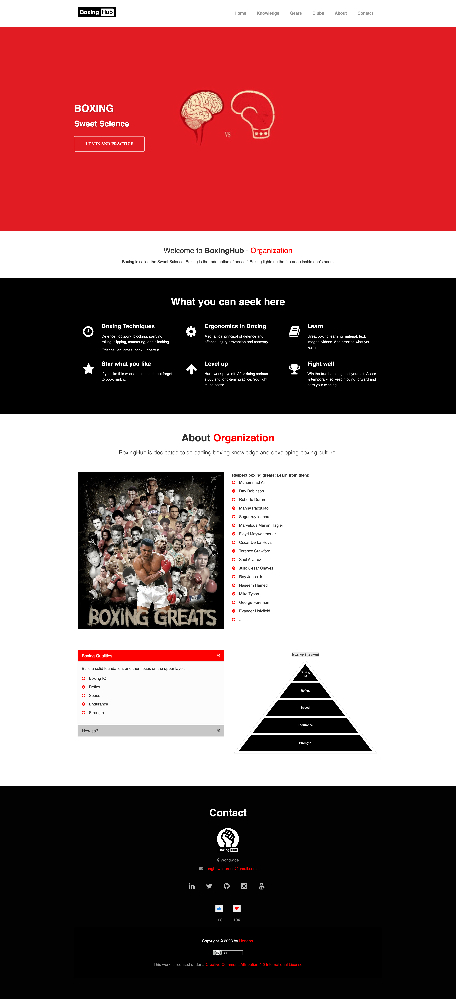

# BoxingHub

## Website Address: https://www.boxinghub.org | https://hongbowei.pythonanywhere.com/

#### Video Demo: https://youtu.be/9yuzUpK1MCM

#### Description: **_BoxingHub_ is dedicated to spreading boxing knowledge and developing boxing culture.**

#### Author: Hongbo Wei from Guiyang, China. A software engineer who loves boxing 🥊!

- It is a web application based on the Flask framework of Python, HTML, CSS, JavaScript and SQLite.
- The design is responsive, and it adapts to all kinds of devices, you can view it on a laptop or a phone.
- This project is an educational website that helps users to learn how to box.
- Users can learn boxing knowledge here, including techniques, theories, rules, and gears.
- It also provides information on top boxing clubs, such as address and contact.
- At the end of each page, the contact information of the developer of the site is displayed.

---

#### Explanation of what each folder contains and each file does:

##### 1. Folder "env": a virtual environment containing a special edition of packages that support the application to run.

##### 2. Folder "static":

- bootstrap: control the aesthetics of the web application.
- css: control the aesthetics of the web application, for example, colour, size, and position. It also makes certain elements more responsive.
- fonts: control the fonts of the web application.
- images: images resources used by this application. Such as logos, backgrounds, and images for the content of different pages.
- js: control how the view effects how a page is loaded, for example, 1. When a user scrolls down, the navigation bar shrinks to provide a better view and convenience to navigate to other pages. 2. When a user scrolls a page, and when the "likes" or "loves" button is clicked. 3. The background of the favicon will be black from 6 am to 6 pm, it will be white during other time.

##### 3. Folder "templates": HTML files that determine the structure of the website.

- base.html: the base layout of each page, so other pages can extend from this one.
- clubs.html: the Club page displays the information of boxing clubs.
- gears.html: the Gear page talks about boxing gears, such as gloves, handwraps, headgear, mouthguards, no-foul protectors.
- index.html: the index page introduces what BoxingHub is, and what it is about.
- recovery.html: the Recovery page is about how an athlete should eat, stretch, and rest so that he/she can avoid and prevent injuries, and recover well from high-intense training.
- rules.html: the Rules page talks about the basic rules of professional boxing, such as weight class, size of gloves, rounds, and titles.
- techniques.html: the Techniques page talks about the fundamental techniques of boxing.

##### 4. File "app.py": the flask configuration file. It connects to the database boxinghub.db, auto-reloads the content of the page if anything changes, provides a different route for users to browse, and updates the database according to the interaction between users and the web app.

##### 5. File "boxinghub.db: an SQLite3 database that records every "likes" and "loves" given by users.

---

#### Follow below two steps below to run the web app:

1. install dependencies

    pip install -r requirements.txt

2. Run server

    flask run

---

😁 **Thanks for your attention!**

---

Copyright (c) [2023-2049] [Hongbo Wei](https://github.com/hongbo-weia)

Shield: [![CC BY 4.0][cc-by-shield]][cc-by]

This work is licensed under a
[Creative Commons Attribution 4.0 International License][cc-by].

[![CC BY 4.0][cc-by-image]][cc-by]

[cc-by]: http://creativecommons.org/licenses/by/4.0/
[cc-by-image]: https://i.creativecommons.org/l/by/4.0/88x31.png
[cc-by-shield]: https://img.shields.io/badge/License-CC%20BY%204.0-lightgrey.svg
